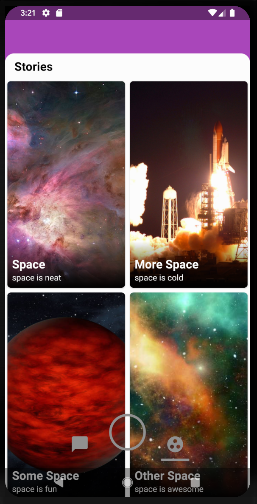

Week 3 - Snap App
===================
### In Class Goals:
 - Quickly review the basics of RecyclerView Adapter 
 - Learn how to add custom interfaces defining all the actions in a ViewHolder 
 - Start work on the SnapApp Stories assignment

----------
### SnapApp Stories assignment 

The goal of this assignment is to review all the concepts we have covered so far including...

 1. Basic RecyclerView use
 2. Adding multiple view types to one RecyclerView [Example from week 2](https://github.com/ucsd-ext-android-rja/andriod-1-week-2-photos/blob/inclass/app/src/main/java/com/ucsdextandroid1/photosapp/profile/FeedAdapter.java)
 3. Using the GridLayoutManager to change our list into a grid [Example from week 2](https://github.com/ucsd-ext-android-rja/andriod-1-week-2-photos/blob/inclass/app/src/main/java/com/ucsdextandroid1/photosapp/profile/ProfileFragment.java#L52-L60)
 4. Override the span of certain items in our list so that even in a grid they still appear like normal list items. [Example from week 2](https://github.com/ucsd-ext-android-rja/andriod-1-week-2-photos/blob/inclass/app/src/main/java/com/ucsdextandroid1/photosapp/profile/FeedAdapter.java#L95-L104)
 5. Add a custom click listener to a view holder and do call a specific method when the click occurs.[Example from week 3](../blob/master/app/src/main/java/com/ucsdextandroid1/snapapp/chat/ChatItemViewHolder.java#L105-L112)

To do this you will finish implementing the **StoryCardViewHolder**, the **StoriesAdapter**  and the **StoriesFragment** classes in the SnapApp project.

The first thing you will need to do is to fork the project by clicking the **Fork** button at the top right part of the screen. Forking is basically just copying a project. You will then be able to import the project into android studio using the import from Version Control (VC) button. Select Git and log into your GitHub account. You will then be able to select the project from the list of repositories. 

Once you have the project on your computer you can open up the folder called stories where all the classes are already created for you. There are //TODO comments which should help guide you through the steps you need to take to finish the code.

I would recommend starting with the ViewHolder, then moving on the the Adapter and the Fragment.

 - The first item in the list should be a title item (the ViewHolder has already been created for you, **StoriesSectionTitleViewHolder**)
 - The list should then display the list of stories items returned by the DataSources class as a grid. 
 - The grid should have a span of 2, meaning you should be able to see 2 stories cards at once. 
 - When you click on the story items in the grid (not the title) the method **onStoryClicked(Story story)** should be called. You can do whatever you want in this method.
 - All //TODO items in these classes should be completed
 
 